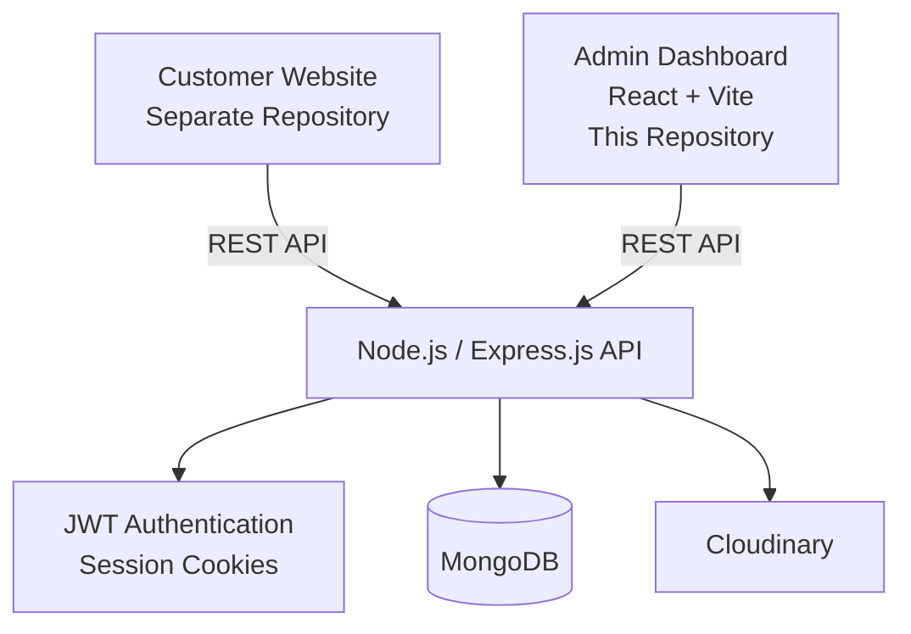

# HK Masso - Admin Dashboard (Frontend)

A role-based administrative web application for managing services, user permissions, worker availabilities, and appointment bookings for HK Masso.

🌐 **Live Demo:** [hk-masso.vercel.app/overview](https://hk-masso.vercel.app/overview)

---

## 🏗️ Architecture

The HK Masso platform is built as separate applications that communicate through a centralized REST API.

* **Customer Website** — Customer-facing application for browsing services and making appointments.
* **Admin Dashboard** — This repository. Provides role-based management tools for staff.
* **Backend API** — Node.js / Express.js REST API responsible for authentication, business logic, and database operations.



The Admin Dashboard does not directly access the database. All data operations are handled through the backend API.

---

## 🚀 Features & Access Control

The dashboard implements fine-grained **Role-Based Access Control (RBAC)** across four user levels: `Super Admin`, `Admin`, `Worker`, and `Receptionist`.

### 🔐 Role Permissions Matrix

* **Super Admin:**

  * User management: Create new staff accounts, modify user roles, and delete users.
  * System guardrails: Enforces a single Super Admin account constraint across the system.
  * Full administrative access over services, availabilities, and bookings.

* **Admin:**

  * Full CRUD control over service listings (prices, durations, and details).
  * Create, edit, and delete worker schedules and availabilities.
  * Manage and update booking statuses or delete bookings.

* **Worker & Receptionist:**

  * View-only access to operational stats, service lists, user profiles, worker availabilities, and customer bookings.

* **All Users:**

  * Profile self-management (account deletion option).
  * Dashboard access protected via secure login using JWT and session cookies provided by the API server.

### 🎨 User Interface & Experience

* **Interactive Data Visualization:** Business performance analytics powered by Recharts.
* **Theme Preference:** Full Light and Dark mode toggle.
* **Error Resilience:** Error boundaries via `react-error-boundary` and toast feedback using `sonner`.
* **Responsive Interface:** Designed for use across desktop and tablet screen sizes.

---

## 📸 Dashboard Preview

Screenshots and feature demonstrations can be added here to showcase the dashboard's main functionality.

### Overview


### Booking Management


### User Management


---

## 🎥 Feature Demos

### Role-Based Access Control


### Booking Management


### Dark Mode


---

## 🛠️ Tech Stack

* **Build Tool & Core:** [React 18](https://react.dev/), [Vite](https://vitejs.dev/)
* **Routing & SEO:** [React Router](https://reactrouter.com/), `react-helmet-async`
* **UI Components & Styling:** [Tailwind CSS](https://tailwindcss.com/), [Radix UI](https://www.radix-ui.com/), `tailwindcss-animate`, [Lucide React](https://lucide.dev/)
* **State Management & Data Fetching:** [TanStack Query (React Query)](https://tanstack.com/query/latest), [Axios](https://axios-http.com/)
* **Forms & Validation:** `react-hook-form`
* **Data Visualization:** [Recharts](https://recharts.org/)
* **Feedback & Error Handling:** `sonner` (Toasts), `react-error-boundary`

> **Note:** This repository houses the **Admin Frontend** interface built with Vite. Authentication, business logic, and database operations are powered by a separate Node.js / Express / MongoDB REST API.

---

## 📂 Getting Started

### Prerequisites

Make sure you have [Node.js](https://nodejs.org/) (v18 or higher) installed.

### Local Setup

1. **Clone the repository:**

```bash
git clone https://github.com/hakimmahtout/hk-masso-admin-frontend.git
cd hk-masso-admin-frontend
```

2. **Install dependencies:**

```bash
npm install
```

3. **Start the development server:**

```bash
npm run dev
```

4. Open the local development URL provided by Vite in your browser.

---

## 🔗 Related Repositories

| Project              | Description                                              |
| -------------------- | -------------------------------------------------------- |
| **Customer Website** | Customer-facing HK Masso application                     |
| **Admin Dashboard**  | Role-based administrative dashboard — this repository    |
| **Backend API**      | Node.js / Express.js REST API powering both applications |

---

## 📄 License

This project is part of the HK Masso platform.
