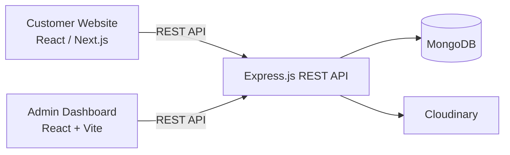

# HK Masso — Customer Website

A modern customer-facing web application for **HK Masso**, allowing customers to explore massage services, discover available workers, and book appointments online.

🌐 **Live Demo:** https://YOUR-CUSTOMER-SITE.vercel.app

---

## ✨ Features

### 💆 Massage Services

* Browse available massage services
* View service details, duration, and pricing
* Explore available treatments

### 📅 Online Booking

* Select a massage service
* Choose an available worker
* Select an available date and time
* Create and manage appointments
* View booking information and status

### 👤 Customer Accounts

* Secure authentication
* Customer profile management
* View personal booking history
* Manage account information

### ⭐ Reviews

* View customer reviews
* Submit reviews after completed appointments
* Display service and worker ratings

### 🎨 User Experience

* Responsive design for desktop, tablet, and mobile
* Light and dark mode
* Interactive UI
* Loading and error states
* Toast notifications for user feedback

---

## 🏗️ Architecture

The HK Masso platform is divided into separate repositories.



The **Customer Website** and **Admin Dashboard** are independent frontend applications that communicate with the same backend API.

---

## 🛠️ Tech Stack

* **Frontend:** React / Next.js
* **Styling:** Tailwind CSS
* **Data Fetching:** TanStack Query
* **HTTP Client:** Axios
* **Forms:** React Hook Form
* **UI Components:** Radix UI
* **Icons:** Lucide React
* **Backend:** Node.js / Express.js
* **Database:** MongoDB
* **Image Storage:** Cloudinary

---

## 📸 Screenshots

### Home Page


### Services


### Booking


---

## 🎥 Feature Demos

### Booking a Massage


### Exploring Services


---

## 🔗 Related Repositories

| Repository           | Description                                                      |
| -------------------- | ---------------------------------------------------------------- |
| **Customer Website** | Customer-facing application                                      |
| **Admin Dashboard**  | Administrative management interface                              |
| **Backend API**      | Express.js REST API, authentication, business logic and database |

---

## 🚀 Getting Started

### Prerequisites

Make sure you have **Node.js 18+** installed.

### Installation

Clone the repository:

```bash
git clone https://github.com/hakimmahtout/YOUR-REPOSITORY.git
cd YOUR-REPOSITORY
```

Install dependencies:

```bash
npm install
```

Start the development server:

```bash
npm run dev
```

The application will be available at the local development URL shown in your terminal.

---

## 📄 License

This project is developed for HK Masso.
